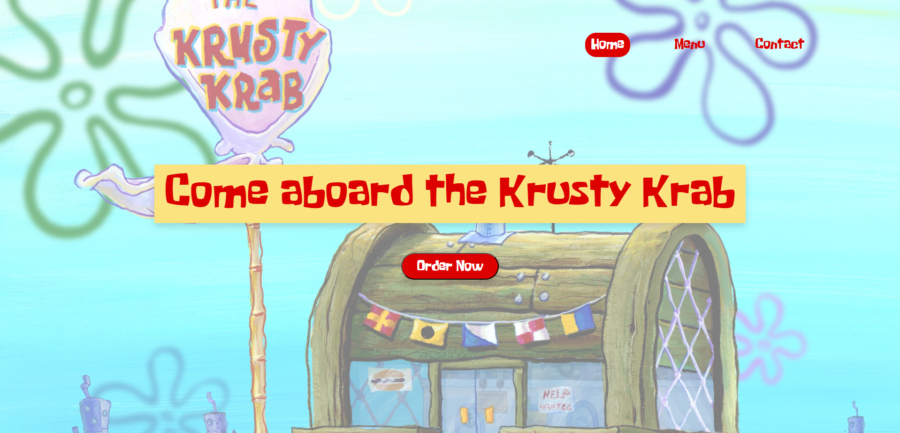
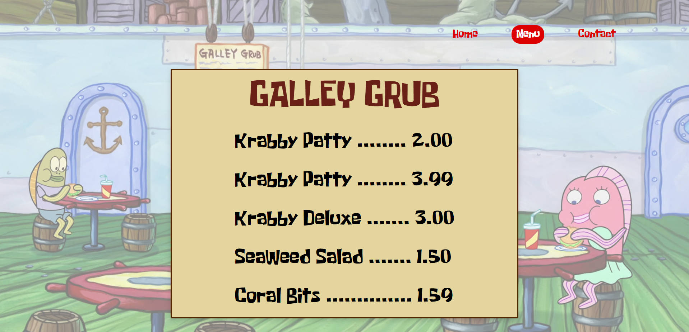
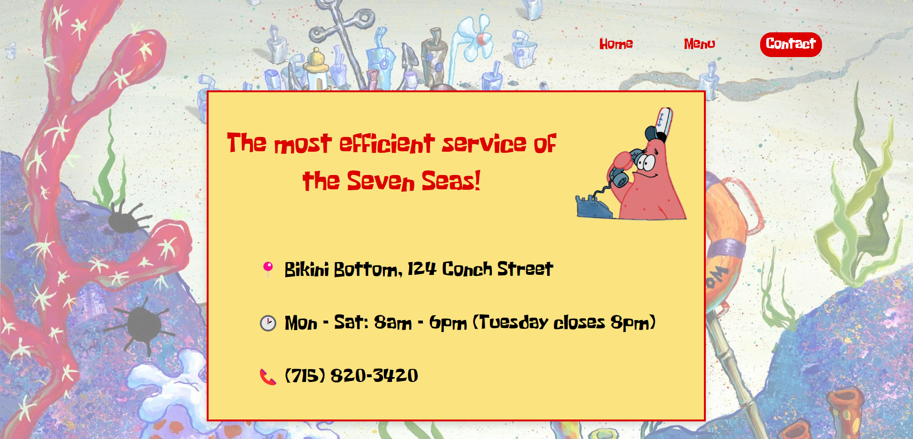

# Krusty Krab

## Introduction

A restaurant homepage built with plain Javascript, HTML and CSS along with Webpack and is part of [The Odin Project](https://www.theodinproject.com/).

## Screenshots
### Homepage

### Menu

### Contact

## Visualize WebPage

This project is hosted on my GitHub Pages, and you can access it [in here](https://daniellima0.github.io/krusty-krab/).